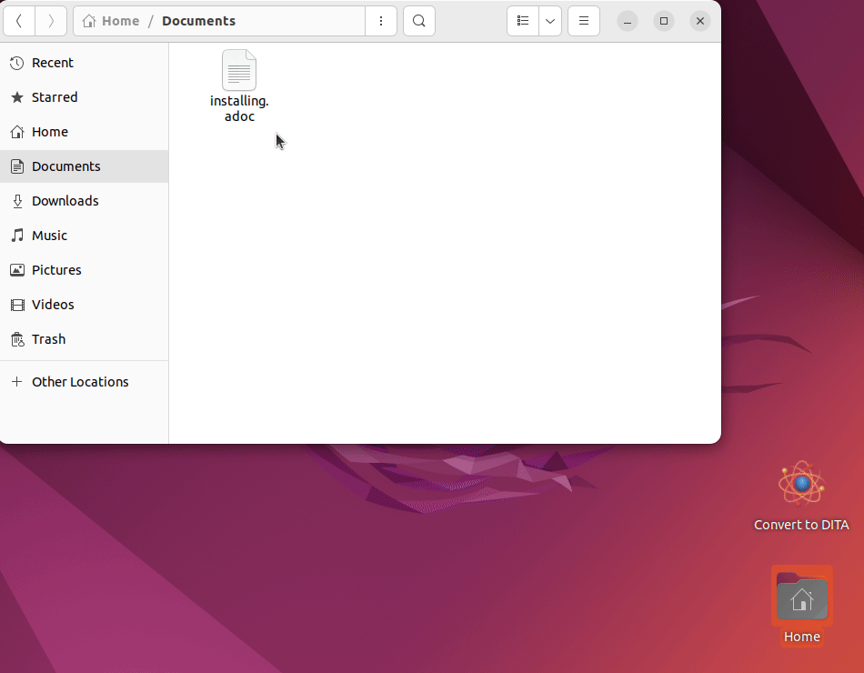

# asciidoctor-dita-gui

**asciidoctor-dita-gui** is a prototype of a simple GUI for converting
AsciiDoc files to DITA concepts, references, or tasks.

## Prerequisites

**asciidoctor-dita-gui** is written in Bash. It requires Zenity and basic GNU utilities such as `grep` and `sed` to be present in the system.

## Installation

1. Install the `asciidoctor` and `asciidoctor-dita-topic` Ruby gems:
   
   ```
   gem install asciidoctor asciidoctor-dita-topic
   ```
2. Install the `dita-convert` Python package:
   
   ```
   python3 -m pip install --upgrade dita-convert
   ```
3. Navigate to the directory with the copy of this repository and run the installation script:

   ```
   sudo make install
   ```
   You can specify the installation path by defining the `prefix` on the command line. For example, to install the script locally to the users home directory, type:

   ```
   make prefix=$HOME/.local install
   ```

## Usage

Run the `asciidoctor-dita-gui` script as follows:

```
asciidoctor-dita-gui [ASCIIDOC_FILE]
```
The `ASCIIDOC_FILE` argument is optional. When you do not supply a file to convert on the command line, the scripts opens a file dialog window for you to select one.

You can also create a desktop launcher for the script. On most modern systems, this will allow you to drag and drop files on the launcher to initiate the conversion:



## Copyright

Copyright © 2024, 2025 Jaromir Hradilek

This program is free software, released under the terms of the MIT license. It is distributed in the hope that it will be useful, but WITHOUT ANY WARRANTY; without even the implied warranty of MERCHANTABILITY or FITNESS FOR A PARTICULAR PURPOSE.
